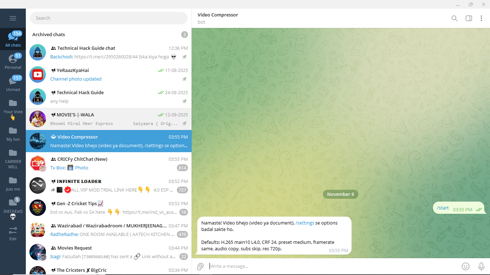
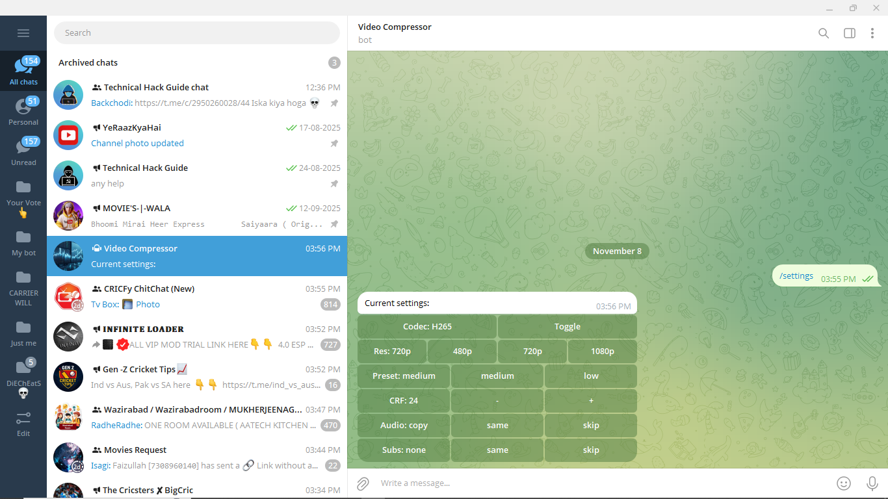
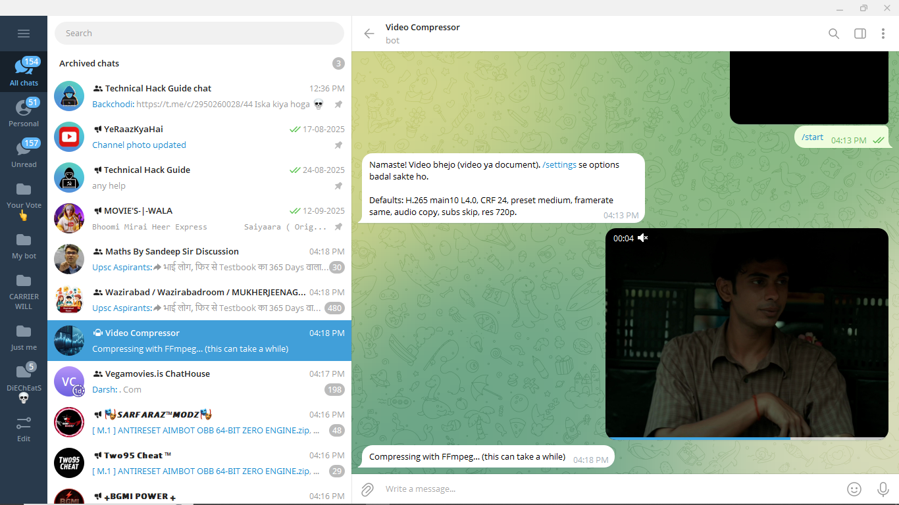
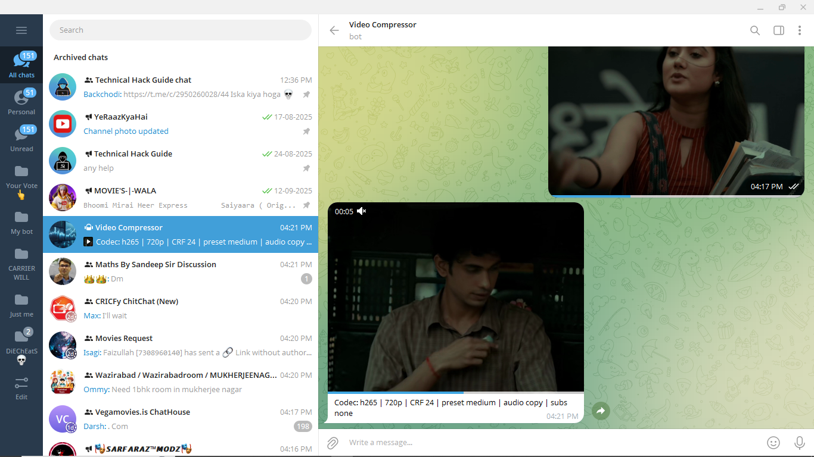

🧑‍💻 Author

# 🎥 Telegram Video Compressor Bot  
**Powered by FFmpeg (H.265 / H.264) + Flask + Render**

This Telegram bot compresses videos using **FFmpeg (libx265 / libx264)** and returns a smaller output while maintaining visual quality.  
Resolution, codec, CRF, audio, and subtitle settings are customizable directly inside Telegram via `/settings`.

---

## ✨ Features

- Compress video using **H.265 / H.264**
- Choose resolution → **480p / 720p / 1080p**
- Adjust **CRF (quality / size balance)**
- Audio → keep or remove
- Subtitle → keep or remove (auto MKV output)
- Runs 24×7 on **Render.com**, no VPS needed
- Sends compressed video back to user

> Output size can reduce **70–90%** depending on video.

---

## 🧠 How to Use

| Step | Action |
|------|--------|
| 1️⃣ | Send `/start` to bot |
| 2️⃣ | Use `/settings` to choose quality options |
| 3️⃣ | **Send video as Document** (important) |
| 4️⃣ | Bot compresses using FFmpeg |
| 5️⃣ | Receive compressed video |

---

## 📸 Screenshots

Example usage:

---

## 🛠️ Deployment (Render)

1️⃣ Clone Repo

git clone https://github.com/Liveserver01/Video-Compress
cd Video-Compress

2️⃣ Create bot via BotFather
/newbot
Copy your BOT_TOKEN.

3️⃣ Deploy to Render

Go to https://render.com
Click New → Web Service
Select your GitHub repo
Render auto-detects Dockerfile
Add Environment Variable:
Key	Value
BOT_TOKEN	Your BotFather token
✅ Deploy — bot starts automatically.

⚙ Environment Variables
Variable Name	Description
BOT_TOKEN	Your Telegram Bot API Token

🧪 Commands
Command	Description
/start	Start bot
/settings	Configure compression
/help	Usage guide

## 📂 File Structure  
├── bot.py # Telegram bot logic

├── ffmpeg_utils.py # FFmpeg command builder

├── settings_store.py # Saves user preferences (JSON)

├── app.py # Flask keep-alive server

├── run.py # Runs bot + Flask

├── Dockerfile # FFmpeg + Python environment

├── requirements.txt # Dependencies

└── render.yaml # Render deployment config

🔗 Social Links

  
  
  
  

⭐ Support

If this bot was useful, consider giving the repo a star ⭐

👉 https://github.com/Liveserver01/Video-Compress

## 📜 License  

MIT License © 2025 VIRENDRA CHAUHAN 

